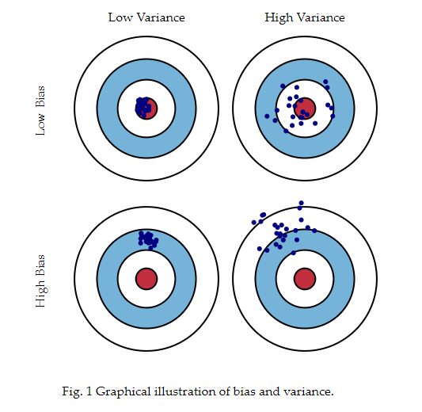

# Bias Varience Tradeoff

This is the problem of simultaneously minimizing two sources of error that prevent supervised learning algorithms from generalising beyond their training set.

1. Bias is an error caused by wrong assumptions in the learning algorithm, high bias causes relevant relationships between features and target outputs to be missed. Also known as underfitting. It is the difference between the expected (or average) prediction of our model and the correct value which we are trying to predict. With high Bias the models predictions are far off the correct values.
2. Varience is an error caused from sensitivity to small fluctuations in the training set, high varience can cause the algorithm to model random noise in the training data rather than the intended outputs. The algorithm is highly tied to the training data set and a new training data set will cause the resulting model to be very different any other. Also know as overfitting. 

The trade off is that we would like some middle ground, to be able to capture relationships in the data while not being tied completely to the training data, generalised enough to predict new data.

The different combinations of Bias vs Varience are:

[Source](http://scott.fortmann-roe.com/docs/BiasVariance.html)
