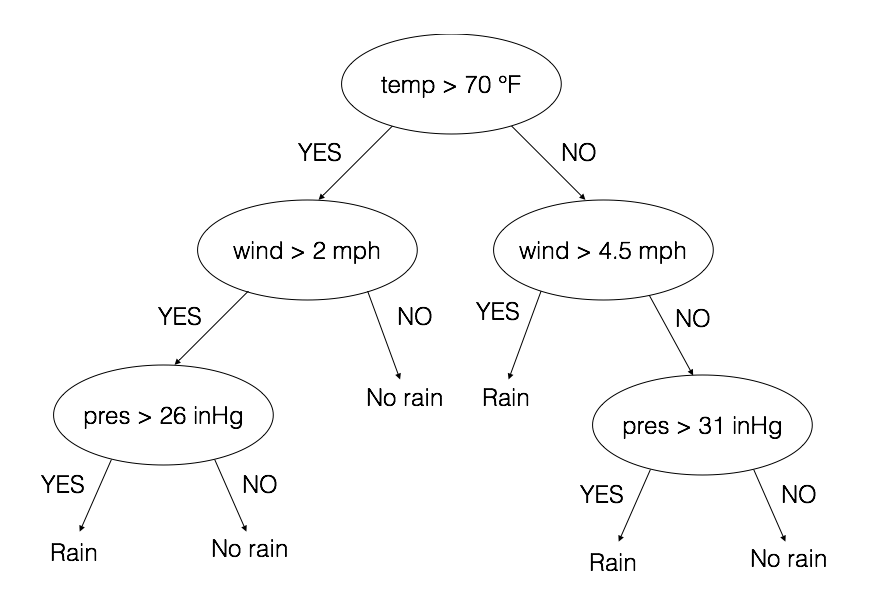

# Decision tree AKA Classification and Regression Trees (CART)

A tree of questions that when a data point is fed through it will answer until it comes to a final decision on the data points category (for the time being I will only talk about classification).

Here is an example:

The question is how to decide the right root node attribute and thresholds?

Things to include in the write up
Cross validation split
number of features to split on is sqrt of the total number of features
https://datascience.stackexchange.com/questions/23666/how-many-features-to-sample-using-random-forests

Gini index https://github.com/rasbt/python-machine-learning-book/blob/master/faq/decision-tree-binary.md
