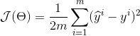

# Gradient Descent

Gradient descent is a first order iterative optimization algorithm used for finding the minimum of a function. 
First order in that it uses the first differential of a function, iterative as in it requires multiple steps to work.
We look for a minimum of a function by finding the first order differential which tells us the gradient at a point.
Starting from a random point, we then take steps along the negative gradient (the step size is the learning rate and is a hyper-parameter) with the assumtion that after many small steps along the negative gradient we will eventually end up to the minimum of the function.

In ML, GD is commonly used to find the minimum of an error/cost function in Linear regression. An example of an error/cost function is:

A gotcha can occur when a function has multiple valleys, once GD hits the minimum of one valley it has no reason to look for other valleys even if they may be lower. 

There are three variations of gradient descent.

1. Batch GD
2. Mini batch GD
3. Stochastic GD

###### Batch
This is what is described above when using the cost function that loops over our entire data set. 

###### Mini batch
Instead of using the full data set we use a small sample. Good choice for very large data sets.

###### Stochastic GD
We use only a single data point, during each iteration we shuffle the training set order. The path to the minima will be noiser from the random points but as long as we find the minima we are indifferent to the path. It also has a shorter training time.

### Useful links
https://towardsdatascience.com/difference-between-batch-gradient-descent-and-stochastic-gradient-descent-1187f1291aa1
