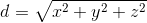

# kNN - k Nearest Neighbours

The long and short of this is that a data point is the same as the others around it.

kNN is one of the more simple predictive models used in regression and classification. It is a type of instance based learning in that it does not use the training data to create a generalised model, rather it relys on its training data to make predictions. It is very math light in that it only assumes:

- the data has some notion of distance,
- that points close to each other are similar.
 

Imagine the data below, Gen 1 is our training data and Gen 2 is our test data. The plot is the attack and defense of pokemon from generation 1 and 2 for the fire and grass types. Scraped from bulbapedia.

The simplest distance measurement is Euclidean distance:

Where x, y and z is the difference between our test point and all the training data points in the respective dimensions. Using this we get a list of distances where we can pick a number of them (k) that have the smallest values i.e. the nearest neighbours. We can then see the majority of the types of the k nearest neighbours and that is our prediction for our test point.
