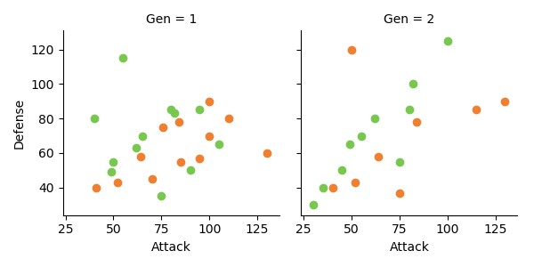

# kNN - k Nearest Neighbours

kNN is one of the more simple predictive models used in regression and classification. It is very math light in that it only assumes:

- the data has some notion of distance,
- that points close to each other are similar.

It is a type of instance based learning in that it does not use the training data to create a generalised model, rather it relys on its training data to make predictions. 

Imagine the data below, Gen 1 is our training data and Gen 2 is our test data. 

The plot is the attack and defense of pokemon from generation 1 and 2 for the fire and grass type pokemon. Scraped from bulbapedia.

The concept says that we can define a distance between points, the simplest being Euclidean distance which is:

